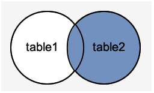

# Joins

* Used with SELECT statement.
* Retrieve data from multiple tables.
* **Types**
    1. INNER JOIN (Simple Join)
    2. LEFT OUTER JOIN (Left Join)
    3. RIGHT OUTER JOIN (Right Join)

## Inner Join (Simple Join)

* **Returns** 
    * All rows from multiple tables where the join condition is satisfied. 
* It is the most common type of join.

* **Syntax**

        SELECT columns  
        FROM table1   
        INNER JOIN table2  
        ON table1.column = table2.column;

* **Example**

        SELECT officers.officer_name, officers.address, students.course_name  
        FROM officers   
        INNER JOIN students  
        ON officers.officer_id = students.student_id;  

## Left Outer Join

* **Returns** 
    * **All** the **rows** from **LHS Table** of ON Condition.
    * **Condition satisfying rows** from **RHS Table** of ON Condtition.
* **NULLS** on the **Right** Table

* **Syntax**

        SELECT columns  
        FROM table1  
        LEFT [OUTER] JOIN table2  
        ON table1.column = table2.column;  

* **Example**

        SELECT  officers.officer_name, officers.address, students.course_name  
        FROM officers  
        LEFT JOIN students  
        ON officers.officer_id = students.student_id; 

## Right Outer Join

* **Returns** 
    * **All** the **rows** from **RHS Table** of ON Condition.
    * **Condition satisfying rows** from **LHS Table** of ON Condtition.
* **NULLS** on the **Left** Table

* **Syntax**

        SELECT columns  
        FROM table1  
        RIGHT [OUTER] JOIN table2  
        ON table1.column = table2.column;  

* **Example**

        SELECT officers.officer_name, officers.address, students.course_name, students.student_name  
        FROM officers  
        RIGHT JOIN students  
        ON officers.officer_id = students.student_id;

